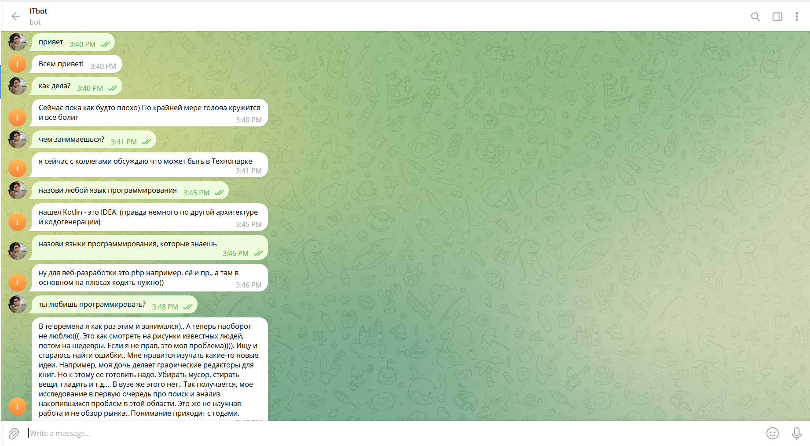
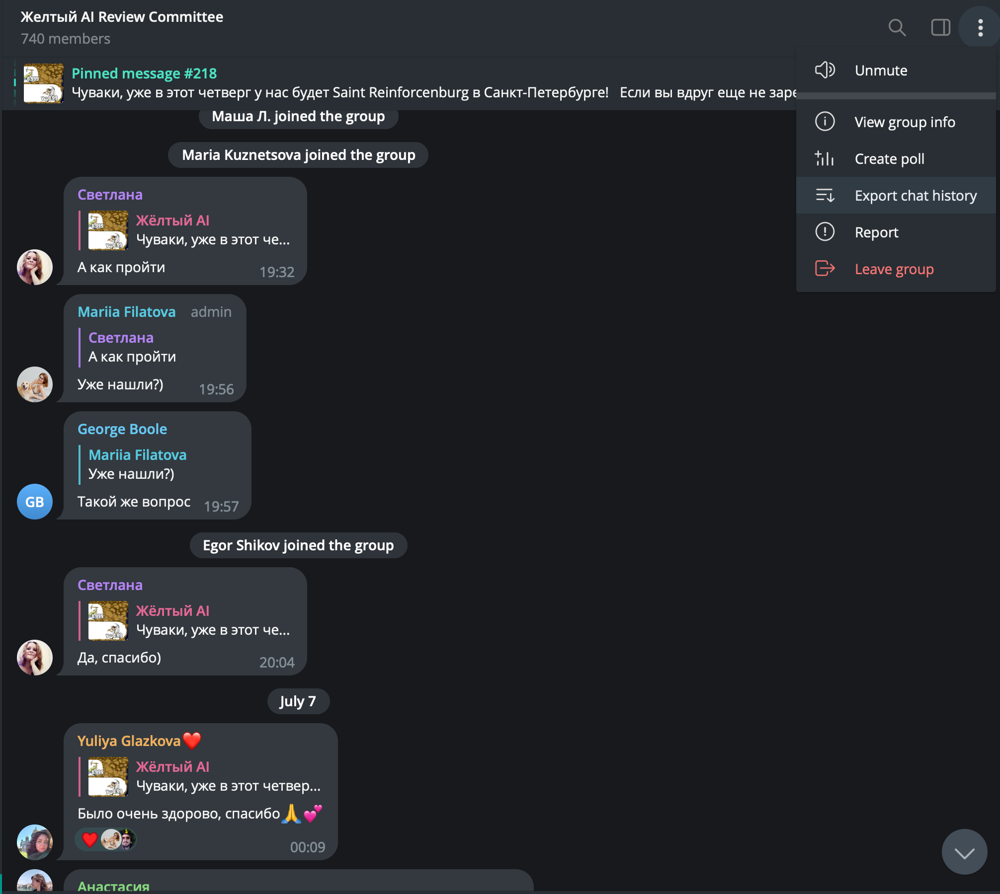

# Кейс по NLP для смены по машинному обучению от Тинькофф в Университете "Сириус"
В рамках задания была дообучена диалоговая языковая модель "Kirili4ik/ruDialoGpt3-medium-finetuned-telegram" и разработан телеграм бота для взаимодействия с ней. 
# Решение
## Загрузка данных
  Для дообучения был выбран чат VK × МГТУ (ex. Технопарк) по тематике IT и образование. Данные были выгружены и обработаны в fine_tuning.ipynb. Данные в формате JSON можно скачать [здесь](https://drive.google.com/drive/folders/1MrtjC7CI9ICFLN4vjwZ46KW74ZPVR6NJ?usp=sharing). Для дообучения необходимо создать папку fine-tuning/data и туда положить файл.
## Дообучение модели
Для обуения была выбрана [DialoGpt](https://huggingface.co/Kirili4ik/ruDialoGpt3-medium-finetuned-telegram). Данная модель создана компанией sberbank-ai, и затем дообучена на телеграм чатах. Модель обучалась 3 эпохи ~33 минуты. Веса можно найти [здесь](https://drive.google.com/drive/folders/1zbj1pzL05xk8cPvhZ3ShgXWTj4L_vZ2N?usp=sharing). Необходимо создать папку bot/models и туда положить веса модели.
## Телеграм бот
Реализован удобный интерфейс взаимодействия с моделью в виде телеграм бота. Функционал телеграм бота включает в себя регистрацию пользователей при вызове команды /start, сохранение контекста для каждого пользователя и удаление контекста с помощью команды /deletecontext для пользователя.
## Пример работы

## Как получить сырые данные из телеграма

В настройках выгрузки нужно выбрать формат json и убрать галочки со всех медиа файлов. Так как данные могут скачиваться долго, в репозитории лежит пример выгруженных данных.
